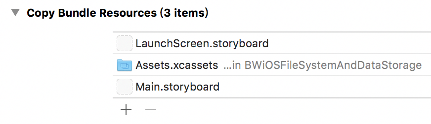

# iOS File System And Data Storage
iOS中的文件系统和数据存储

## Contents

- 文件系统
  - Bundle
  - Sandbox（沙盒）
- 数据存储
  - NSUserDefaults
  - Archive和Unarchive
  - SQLite
- 项目运用
  - 埋点
- 开发经验
- Reference

## 文件系统

按照数据文件存储的类型，iOS中的文件系统可以分为Bundle和Sandbox两种。

### Bundle

Xcode项目中的Copy Bundle Resources引用的资源会在Build时被直接拷贝到应用程序的Bundle中

查看或者编辑哪些资源要拷贝到Bundle中：Target -> Build Phases -> Copy Bundle Resources



查看Build出来的包中的内容：Products -> 在Finder中显示 ->  .app -> 显示包内容


Bunlde的特点：**只读**

作用：1、资源的统一管理；2、防止资源文件跟项目中的同名；3、防止不必要的对资源文件的编辑。

项目运用：1、只读的配置参数文件；2、Localize；3、资源文件。

#### Bundle的实用操作

Bundle资源的获取

```objective-c
// 资源类型为Groups，即在添加文件目录的时候类型选择为Create groups，或者，是在mainBundle下的文件不包括文件目录
NSString *path = [[NSBundle mainBundle] pathForResource:@"file_name" ofType:@"resource_type"];

// 资源类型为Folder References，即在添加文件目录的时候类型选择为Create folder references
NSString *path = [[NSBundle mainBundle] pathForResource:@"file_name" ofType:@"resource_type"inDirectory:@"directory_path"];
NSString *path = [[NSBundle mainBundle] pathForResource:@"directory_path/file_name" ofType:@"resource_type"];

// 资源类型为Bundle，则需要用全路径创建一个Bundle对象，再通过该对象去获取资源路径，Bundle没有Groups和Folder References之分，都通过这种方式去获取其中的资源
NSBundle *bundle = [NSBundle bundleWithPath:[NSBundle.mainBundle pathForResource:@"bundle_name" ofType:@"bundle"]];
NSString *path = [bundle pathForResource:@"temp" ofType:@"txt"];

// 获取Info.plist中的数据
NSDictionary *dictInfo = [[NSBundle mainBundle] infoDictionary];

// 说明：Groups为创建组，其中的文件可以加入编译；Folder References为仅仅是做文件目录的引用，可以把此目录拷贝到Bundle下
```

Bundle资源的制作

> 创建一个文件目录，把目标文件放入目录，修改文件目录的后缀名为“ .bundle ”，需要用到的地方，直接进行导入即可；
>
> 如果需要编辑其中的内容，则右击“显示包内容”，即可对其中的内容进行修改。

### Sandbox

出于安全因素的考虑，iOS将各个App分别严格地存放在文件系统的独立位置这样的机制称为“沙盒”（Sandbox），别的APP无法访问；在App的安装过程中，系统为每个App生成它的主目录和一些关键的子目录。

#### 文件目录概览

Documents

Library（Caches、Preferences）

tmp

#### 文件目录说明

Documents：存储缓存数据，在iOS系统内存不足时不会被清除，此类缓存数据应该要在App内设置有清理缓存的功能；

Library -> Caches：缓存数据，在iOS系统存储不足进行存储清理时会被清除，此类缓存数据在App上的用户手动清理可有可无；

Library -> Preferences：用户偏好设置目录，NSUserDefault的数据存储目录；一般只放NSUserDefault的缓存数据；

tmp：App关闭时里面的缓存数据会被清空；

#### Sandbox的实用操作

Sandbox目录路径

```objective-c
// Sandbox目录路径
NSString *pathSandbox = NSHomeDirectory();

// Documents目录路径
NSString *docPath = NSSearchPathForDirectoriesInDomains(NSDocumentDirectory, NSUserDomainMask, YES).firstObject;

NSArray *docPathArray = NSSearchPathForDirectoriesInDomains(NSDocumentDirectory, NSUserDomainMask, YES);  
NSString *docPath = docPathArray.firstObject;
// 参数说明：YES：路径中包含所有全部路径名，NO：沙盒路径表示为“~”

// Library目录路径
NSString *libraryPath = NSSearchPathForDirectoriesInDomains(NSLibraryDirectory, NSUserDomainMask, YES).firstObject;

NSArray *libraryPathArray = NSSearchPathForDirectoriesInDomains(NSLibraryDirectory, NSUserDomainMask, YES);
NSString *libraryPath = libraryPathArray.firstObject;

// Library -> Caches目录路径
NSString *cachePath = NSSearchPathForDirectoriesInDomains(NSCachesDirectory, NSUserDomainMask, YES).firstObject;

NSArray *cachesPathArray = NSSearchPathForDirectoriesInDomains(NSCachesDirectory, NSUserDomainMask, YES);
NSString *cachePath = cachesPathArray.firstObject;

// Library -> Preferences目录路径
// 没有获得此目录的参数，一定要获得的话只能通过先获得Library路径然后拼上Preferences；一般不在此目录进行文件操作，iOS默认把此目录作为NSUserDefault的存储路径；
tmp目录路径

// tmp
NSString *tmpPath = NSTemporaryDirectory();
```

文件操作

```objective-c
// 获得NSFileManager
NSFileManager *fileManager = [NSFileManager defaultManager];

// 判断文件夹/文件是否存在
[fileManager fileExistsAtPath: ];

// 创建文件夹
[fileManager createDirectoryAtPath: withIntermediateDirectories: createIntermediates attributes: error: ]
// 说明：参数createIntermediates为是否创建新建文件目录里不存在的中间目录，详见文档，根据error判断是否成功创建

// 创建文件
[fileManager createFileAtPath: contents: attributes: ];
// 说明：成功创建和文件已经存在都会返回YES，所以有时需要让程序更清晰，需要在创建文件前先判断文件是否已经存在，存在则不进行创建；

// 删除文件或文件夹
[fileManager removeItemAtPath: error: ];
```

#### Sandbox开发经验

定义获得Sandbox路径的方法在工具类

> 获得Sandbox的路径定义在工具类方法上，方便需要使用到的地方便捷地进行调用。

使用数据工具类方法进行Sandbox路径的获取

> 把获得Sandbox路径的方法封装起来放入项目中的数据工具类，供需要用到的地方进行调用，使用宏定义来获取路径会增加执行文件的代码量，不建议使用宏定义。

文件路径注意需要加上“/”符号

> 获得的目录路径一般是没有“/”的，注意在创建文件路径的时候加上“/”。

覆盖安装App对Sandbox的影响

> 描述：App的覆盖安装对Sandbox不会有影响，新内容是二进制代码。

> 思考：打开覆盖安装的App，如何判断为首次启动新版本的App，然后可能需要对Sandbox进行操作，如数据库的升级；实现方案，在Sandbox存储一个版本号，每次启动App时和当前的版本号进行比对，如果有更改则判定为首次启动新版本App。

## 数据存储

### NSUserDefaults

NSUserDefaults的数据以.plist文件的形式存储，存储目录为App的Sandbox下Library -> Preferences，实质就为以XML数据格式存储

**NSUserDefaults允许的数据类型**

基本数据类型

> floats, doubles, integers, Booleans, and URLs；

Property List对象类型

> 必须为Property List，集合对象里面的对象也必须为Property List，包括：NSData, NSString, NSNumber, NSDate, NSArray, or NSDictionary

任何其他对象类型

> Apple Document：If you want to store any other type of object, you should typically archive it to create an instance of NSData；

> 描述：存：先Archive为NSData，然后以NSData的形式存储进NSUserDefault；取：取NSData，然后进行Unarchive；

**NSUserDefaults的实用操作**

```objective-c
// NSUserDefaults shared instance的获得
NSUserDefaults * userDefaults = [NSUserDefaults standardUserDefaults];


// 数据的存储
// 基本数据类型
/// -setInteger:forKey: is equivalent to -setObject:forKey: except that the value is converted from an NSInteger to an NSNumber.
[userDefaults setXXX:value forKey:key];


// Property List对象类型
[userDefaults setObject:object forKey:key];

// 注意
对象只能为Property List Objects（NSData, NSString, NSNumber, NSDate, NSArray, or NSDictionary，其中NSArray和NSDictionary中的对象也是）

// 其他类型参看文档

// 数据的读取
[userDefaults xxxForKey:key];  // 基本数据类型
[userDefaults objectForKey:key];  // 对象类型

// 数据的移除
- (void)removeObjectForKey:(NSString * _Nonnull)defaultName；
```

**NSUserDefaults开发经验**

需要时，调用[userDefaults synchronize]对数据进行即刻的保存

存储用户的Preferences

存储简单的需要持久性存储的数据

### Archive和Unarchive

实例对象和特定编码形式的数据之间的相互转换，可以把这编码后的数据写入文件，然后把文件存储起来，供下次需要时进行使用

**Archive和Unarchive在类中的实现**

```objective-c
// 遵循协议 - NSCoding
- (void)encodeWithCoder:(NSCoder *)aCoder；
- (instancetype)initWithCoder:(NSCoder *)aDecoder；

// 实现协议方法
- (void)encodeWithCoder:(NSCoder *)aCoder {
    [aCoder encodeObject:object forKey:key];
    [aCoder encodeBasicDataType:xxx forKey:key];
}

- (instancetype)initWithCoder:(NSCoder *)aDecoder {
    if (self = [self init]) {
        _object = [aDecoder decodeObjectForKey:key];
        _number = [aDecoder decodeIntegerForKey:key];
    }
    return self;
}

// 说明：Encode的对象为Property List对象类型；
```

**Archive和Unarchive的实用操作**

```objective-c
// Archive
[NSKeyedArchiver archiveRootObject:modelObject toFile:pathArchivedFile];

// Unarchive
ModelObject * modelObject = [NSKeyedUnarchiver unarchiveObjectWithFile:pathArchivedFile];

// 对象和Data类型互转（获得对象Archive的Data和通过Data获取对象）
NSData *data = [NSKeyedArchiver archivedDataWithRootObject:object];
NSObject *object = [NSKeyedUnarchiver unarchiveObjectWithData:object];
```

**Archive和Unarchive开发经验**

NSUserDefaults存取Archive之后的Data对象，开发中，如果想便捷的存储一个对象，而又不想对对象进行拆分存储，可以使用这种方法进行对象的存储

Archive存储的集合类型里的对象不能为nil，如果nil会报错，因为nil不是对象类型，解决方法，使用NSMutableDictionary把空字符串替换为@""

存取方法的封装

存取路径名的统一

Archive和Unarchive复杂的对象

### SQLite

轻量级数据库

框架：libsqlite3.tbd

使用SQL语句对数据库进行操作，需要熟练使用SQL

常用的第三方框架：FMDB

适用场景：大量的数据，而且需要频繁地对数据要有修改操作的

## 项目运用

### 埋点

**需求：**用户行为的数据统计和分析

**流程设计：**埋点 -> 记录数据 -> App在后台/App will be killed/其他时机 -> 发送统计数据 -> 发送成功，删除本地已发送的数据 -> 重复流程

**实现方案：**

> 统计数据的存储方案：数据库-表

> 表字段的设计
>
> ​	业务无关的参数
>
> ​		ActionCode事件编码
>
> ​		ActionType事件类型（可选，如点击或者其他）
>
> ​		TimeStamp事件时间
>
> ​		GPS位置信息
>
> ​		IP地址
>
> ​		Account用户账户
>
> ​		SendType发送状态
>
> ​	业务相关的参数
>
> ​		BusinessParams业务参数（使用JSON字符串存储业务参数，不给数据表增加多余的字段，免得让表结构变得难以维护）

> 实现技术：**文件系统**对数据库文件进行创建和管理，使用FMDB对数据库进行增删改查的操作

## 开发经验

规范和灵活使用文件系统和数据存储去实现项目开发中的需求功能，让项目代码更加健壮

## Reference

Sandbox：

https://developer.apple.com/library/content/documentation/Security/Conceptual/AppSandboxDesignGuide/AboutAppSandbox/AboutAppSandbox.html#//apple_ref/doc/uid/TP40011183-CH1-SW1